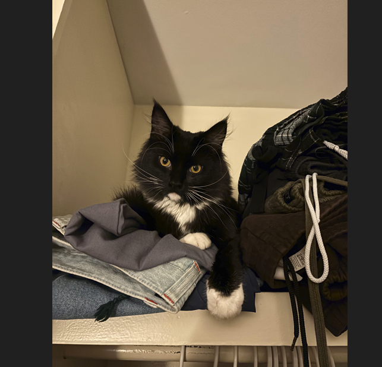

# HW# - EC 0.6 - Reports
### Qin Davis
### CS 432, Fall 2025
### 9/7/2025

# Q1

*You may copy the question into your report, but make sure that you make it clear where the question ends and your answer begins.*

## Answer

The example figure below shows the growth in the number of websites between 1993 and 1996.



*If you want to include code in your report, you can insert a screenshot (if it's legible), or you can copy/paste the code into a fenced code block.*

```python
#!/usr/local/bin/python3

print("hello World")
```

The table below shows a simple table.  

|Week|Date|Topic|
|:---|:---|:---|
|1|Aug 23|Introduction to Web Sciences and Web Architecture|
|2|Aug 30|Introduction to Python|
|3|Sep 6|Measuring The Web|
|4|Sep 13|Searching The Web|

The table below shows an example confusion matrix (you'll see this term later) from <https://en.wikipedia.org/wiki/Confusion_matrix>.

| | |Actual||
|---|---|---|---|
|**Predicted**| |Cat|Dog|
| |Cat|5 (TP)|3 (FP)|
| |Dog|2 (FN)|3 (TN)|

*You must provide some discussion of every answer. Discuss how you arrived at the answer and the tools you used. Discuss the implications of your answer.*

# Q2

## Answer

# Q3

## Answer

# References

*Every report must list the references that you consulted while completing the assignment. If you consulted a webpage, you must include the URL.  These are just a couple examples.*

* Stack Overflow, How do I save my changes and exit Vim?, <https://stackoverflow.com/questions/14613451/how-do-i-save-my-changes-and-exit-vim>
* GitHub Discussions, My github webpage is not updating after changes are made, <https://github.com/orgs/community/discussions/19713>
* Python Download, <https://www.python.org/downloads/>
